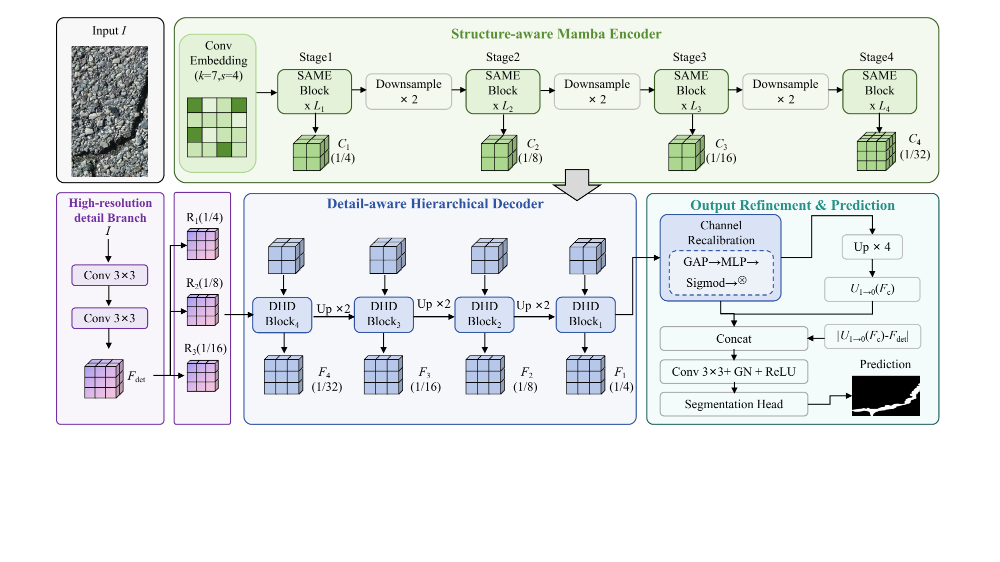

# StructCrack

Lightweight structure-aware Mamba network for fine-grained crack segmentation.

## Overview

StructCrack is a research implementation for binary pixel-level segmentation of cracks in structural images. The framework combines a structure-aware Mamba encoder, a detail-aware hierarchical decoder, output refinement, and a reproducible training and evaluation pipeline.

The code is organized for controlled experiments on public crack-segmentation benchmarks. Dataset files, annotations, and trained weights are not redistributed in this repository.

## Method



The implementation includes a structure-aware visual state-space encoder, gated bottleneck convolution, multi-scale feature fusion, a high-resolution detail branch, hierarchical decoding, and a binary segmentation head.

## Public datasets

The following public resources are referenced by the implementation and the associated experiments. Access conditions and dataset licenses are determined by the original providers.

| Dataset | Source and access | Intended use |
| --- | --- | --- |
| TUT | [TUT repository](https://github.com/Karl1109/TUT) | Crack segmentation benchmark and split reference |
| DeepCrack | [DeepCrack repository](https://github.com/yhlleo/DeepCrack) | Pixel-level crack segmentation benchmark |
| Crack500 | [Pavement crack detection repository](https://github.com/fyangneil/pavement-crack-detection) | Pavement crack segmentation benchmark |
| CrackMap | [CrackMap repository](https://github.com/niuchuangnn/CrackMap) | Multi-scene crack segmentation benchmark |

Users should download each dataset from its source, verify the current access instructions, and record the dataset version and split used in an experiment. The repository provides the expected directory layout but does not redistribute the data.

## Repository structure

```text
.
|-- StructCrack/
|   |-- datasets/       Dataset loading and augmentation
|   |-- eval/           Segmentation evaluation
|   |-- models/         Decoder and feature modules
|   |-- mmcls/          SAVSS and supporting modules
|   |-- main.py         Training entry point
|   |-- test.py         Inference entry point
|   |-- option.py       Experiment configuration
|   `-- requirements.txt
|-- README.md
`-- .gitignore
```

## Environment

Reference environment: Python 3.10, PyTorch 1.13.1, torchvision 0.14.1, CUDA 11.6, MMCV, Mamba-SSM 1.2.0, OpenCV, NumPy, and the packages in [`StructCrack/requirements.txt`](StructCrack/requirements.txt).

```bash
cd StructCrack
conda create -n structcrack python=3.10 -y
conda activate structcrack
pip install -r requirements.txt
```

Install a CUDA-compatible PyTorch and torchvision build before compiled dependencies such as MMCV and Mamba-SSM.

## Dataset format

```text
DATASET_ROOT/
|-- train/image/
|-- train/seg_gt/
|-- val/image/
|-- val/seg_gt/
|-- test/image/
`-- test/seg_gt/
```

Images and masks are paired by filename. Masks are binarized by the dataset loader using a threshold of 127.

## Reproducibility

Training:

```bash
cd StructCrack
python main.py --dataset_path /path/to/DATASET_ROOT \
  --exp_preset high_acc \
  --output_dir ./logs/checkpoints/structcrack_highacc
```

Inference:

```bash
cd StructCrack
python test.py --help
python test.py
```

Evaluation:

```bash
cd StructCrack
python eval_compute.py
python eval/evaluate.py
```

Available experiment presets are defined in `StructCrack/option.py`, including `baseline`, `high_acc`, `lightweight`, and ablation configurations.

## Code Availability

Source code: <https://github.com/crack1111-svg/crack>
