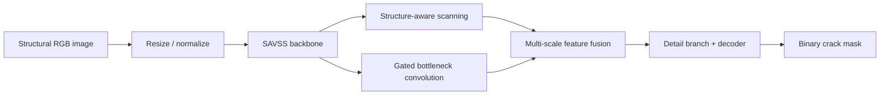

# StructCrack: Lightweight Structure-Aware Mamba Network for Crack Segmentation

This repository provides the research code for the manuscript **“StructCrack: A Lightweight Structure-Aware MambaNetwork for Fine-Grained Crack Segmentation.”** The implementation is contained in [`StructCrack/`](StructCrack/).

The model is designed for binary pixel-level segmentation of cracks in structural images. It contains a structure-aware visual state-space backbone, gated bottleneck convolution, structure-aware feature processing, multi-scale fusion, a detail branch, and a decoder. Training, inference, model profiling, and metric computation are provided as executable scripts.

## Manuscript

The manuscript PDF is included for reference: [Download StructCrack manuscript](StructCrack_manuscript.pdf).

## Model architecture

The model figure from the manuscript is available as [PDF](StructCrack/docs/figures/model.pdf) and as a [PNG preview](StructCrack/docs/figures/model.png).


## Visual method summary



The repository does not include dataset images, prediction examples, or checkpoint files. Numerical results should be taken from the manuscript and reproduced using the documented dataset split and configuration.

## Main contents

| Path | Description |
| --- | --- |
| [`StructCrack/main.py`](StructCrack/main.py) | Training entry point |
| [`StructCrack/test.py`](StructCrack/test.py) | Checkpoint-based inference |
| [`StructCrack/eval_compute.py`](StructCrack/eval_compute.py) | Prediction metric computation |
| [`StructCrack/option.py`](StructCrack/option.py) | Experiment presets and hyperparameters |
| [`StructCrack/models/`](StructCrack/models/) | Model modules, fusion, detail branch, and decoder |
| [`StructCrack/mmcls/SAVSS_dev/`](StructCrack/mmcls/SAVSS_dev/) | SAVSS implementation |
| [`StructCrack/datasets/`](StructCrack/datasets/) | Image-mask loading and training augmentation |
| [`StructCrack/eval/`](StructCrack/eval/) | F1, precision, recall, mIoU, ODS, and OIS evaluation |
| [`StructCrack/README.md`](StructCrack/README.md) | Full installation and reproducibility guide |
| [`StructCrack/CODE_AVAILABILITY.md`](StructCrack/CODE_AVAILABILITY.md) | Manuscript-facing code availability statement |

## Environment

The reference environment is Python 3.10, PyTorch 1.13.1, torchvision 0.14.1, CUDA 11.6, `mmcv-full`, Mamba-SSM 1.2.0, OpenCV, NumPy, and the packages listed in [`StructCrack/requirements.txt`](StructCrack/requirements.txt). Linux with an NVIDIA GPU is recommended because MMCV and Mamba-SSM include compiled components. Windows users may need to select compatible pre-built wheels or build tools.

```bash
cd StructCrack
conda create -n structcrack python=3.10 -y
conda activate structcrack
pip install -r requirements.txt
```

Install a PyTorch and torchvision wheel compatible with the local CUDA driver before installing compiled dependencies. Record the exact package versions and GPU used for any reported experiment.

## Dataset access and format

The loader expects paired images and binary masks in this form:

```text
DATASET_ROOT/
├── train/image/      training images
├── train/seg_gt/     training masks
├── val/image/        validation images
├── val/seg_gt/       validation masks
├── test/image/       test images
└── test/seg_gt/      test masks
```

The code supports a dataset root supplied through `--dataset_path`. Dataset images and annotations are not included in this repository. Users should obtain them from the official providers, comply with their licenses, and document the dataset version, access conditions, and split used.

Potential benchmark sources mentioned by the underlying project include [TUT](https://github.com/Karl1109/TUT), [DeepCrack](https://github.com/yhlleo/DeepCrack), [Crack500](https://github.com/fyangneil/pavement-crack-detection), and [CrackMap](https://github.com/niuchuangnn/CrackMap). These links are provided for dataset discovery only; users must verify the current official source and redistribution terms before use.

## Usage

From `StructCrack/`:

```bash
python main.py --dataset_path /path/to/DATASET_ROOT \
  --exp_preset high_acc \
  --output_dir ./logs/checkpoints/structcrack_highacc
```

Available presets include `baseline`, `high_acc`, `lightweight`, and the ablation presets defined in `option.py`.

For inference, provide a compatible checkpoint through the arguments accepted by `test.py`:

```bash
python test.py --help
python test.py
```

For evaluation of generated predictions:

```bash
python eval_compute.py
python eval/evaluate.py
```

The evaluation implementation calculates threshold-dependent precision, recall, and F1, as well as mIoU, ODS, and OIS. Results are only comparable when preprocessing, mask thresholding, split, checkpoint, and evaluation protocol are held constant.

## Reproducibility and code availability

The public repository URL is:

<https://github.com/crack1111-svg/crack>

Before submitting the manuscript revision, create a versioned GitHub release and archive it with Zenodo or another recognised DOI-assigning repository. Insert the permanent DOI and release tag into [`StructCrack/CODE_AVAILABILITY.md`](StructCrack/CODE_AVAILABILITY.md) and the manuscript’s Code Availability section. The manuscript-matching release should include the source code, configuration, split/index files where permitted, environment description, and evaluation instructions.
