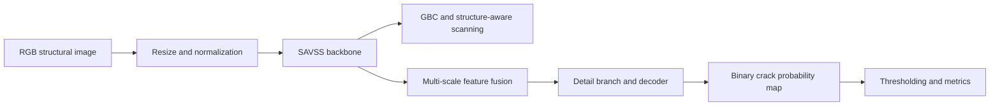

# StructCrack: Lightweight Structure-Aware Mamba Network for Crack Segmentation

This repository contains the implementation associated with **StructCrack**, a lightweight structure-aware Mamba network for pixel-level crack segmentation in structural images.

The implementation combines a structure-aware visual state-space module (SAVSS), gated bottleneck convolution (GBC), structure-aware scanning, feature fusion, and a detail branch. The repository also includes dataset loading, training, inference, model profiling, and segmentation-metric evaluation utilities.

> **Reproducibility note.** This repository is a code release. The dataset images, annotations, checkpoints, and numerical results are not redistributed here unless their respective licenses permit redistribution. Please obtain datasets from their official sources and report the exact release, split, checkpoint, and configuration used for each experiment.

## Repository status

The code is being prepared for public release in support of the manuscript:

> *StructCrack: A Lightweight Structure-Aware MambaNetwork for Fine-Grained Crack Segmentation*

The codebase contains experiment controls in `option.py`, including baseline, high-accuracy, lightweight, and ablation presets. The repository should be tagged with a version corresponding to the manuscript revision before citation.

## Method overview



The released code implements the following main components:

- `models/GBC.py`: gated bottleneck convolution;
- `mmcls/SAVSS_dev/models/SAVSS/`: structure-aware visual state-space components;
- `models/MFS.py` and `models/PAF.py`: feature fusion modules;
- `models/detail_branch.py` and `models/decoder.py`: detail refinement and decoding;
- `datasets/crack_dataset.py`: paired image-mask loading and training augmentation;
- `eval/` and `eval_compute.py`: F1, precision, recall, mIoU, ODS, and OIS evaluation.

The model architecture diagram is available at [`docs/figures/structcrack_architecture.svg`](docs/figures/structcrack_architecture.svg). No dataset images, checkpoints, or unverified result plots are included in this code release.

## Directory structure

```text
.
├── datasets/                 Dataset and augmentation implementation
├── eval/                     Evaluation helpers
├── mmcls/                    Local classification utilities used by the model
├── models/                   Backbone, fusion, detail, and decoder modules
├── tools/                    Profiling utilities
├── util/                     Logging, output, and model-profile helpers
├── main.py                   Training entry point
├── test.py                   Inference entry point
├── eval_compute.py           Metric computation entry point
├── option.py                 Experiment and model configuration
└── engine.py                 Training loop
```

## Environment

The original implementation was developed for the following software stack. Exact compatibility may depend on the CUDA driver and GPU architecture.

| Component | Version used by the reference setup |
| --- | --- |
| Operating system | Linux recommended; Windows may require dependency adjustments |
| Python | 3.10 |
| PyTorch | 1.13.1 |
| torchvision | 0.14.1 |
| CUDA build | 11.6 in the reference setup |
| MMCV | `mmcv-full`, compatible with the selected PyTorch/CUDA build |
| Mamba-SSM | 1.2.0 |
| NumPy | compatible version for the selected PyTorch stack |
| OpenCV | required by the dataset and evaluation code |

Install the pinned high-level dependencies with:

```bash
conda create -n scsegamba python=3.10 -y
conda activate scsegamba
pip install -r requirements.txt
```

Install the PyTorch wheel appropriate for the target CUDA version before installing `mmcv-full` and `mamba-ssm`. These packages include compiled extensions; consult their official installation instructions when the local CUDA version differs from the reference setup.

## Dataset format

The default dataset loader expects one dataset root with the following structure:

```text
DATASET_ROOT/
├── train/
│   ├── image/
│   └── seg_gt/
├── val/
│   ├── image/
│   └── seg_gt/
└── test/
    ├── image/
    └── seg_gt/
```

Images and masks are paired by filename. The loader binarizes masks using a threshold of 127. It resizes validation and test images to `load_size` and applies random resizing, cropping, flipping, rotation, photometric perturbation, blur, and noise during training when augmentation is enabled.

Do not commit restricted datasets or copied annotations to this repository. Instead, provide the official dataset URL, access conditions, dataset version, and a split/index file. The manuscript Data Availability Statement should contain the same information.

## Training

Run training from the repository root:

```bash
python main.py --dataset_path /path/to/DATASET_ROOT \
  --exp_preset high_acc \
  --output_dir ./logs/checkpoints/scsegamba_highacc
```

Available presets are `baseline`, `high_acc`, `lightweight`, and the ablation presets defined in `option.py`. For a controlled experiment, record the complete command line, random seed, dataset split, GPU model, CUDA version, checkpoint selection rule, and final threshold.

To inspect all command-line options:

```bash
python main.py --help
```

## Inference

Configure the dataset and checkpoint paths in the command-line arguments accepted by `test.py`, then run:

```bash
python test.py --help
python test.py
```

The exact checkpoint argument names should be verified against the tagged release used for the manuscript, because checkpoint layout is controlled by the current implementation and experiment configuration.

## Evaluation

For prediction files produced by the inference script, use:

```bash
python eval_compute.py
python eval/evaluate.py
```

The evaluation code reports threshold-dependent precision, recall, and F1, together with mIoU, ODS, and OIS. Do not compare results produced with different image resizing rules, mask conventions, thresholds, or dataset splits without documenting those differences.

## Data and code availability

The source code is intended to be publicly available at:

<https://github.com/crack1111-svg/crack>

After the repository has been created, archive the manuscript-matching release with Zenodo or another DOI-minting repository and replace the placeholder below with the permanent DOI:

```text
Code DOI: to be assigned after the public release is archived.
```

The public release should include the source code, configuration files, dataset split/index files where redistribution is permitted, environment information, evaluation instructions, and manuscript-matching checkpoints where redistribution is permitted. Dataset images and annotations remain subject to the terms of their original providers.

## Limitations and responsible use

This release does not establish that the model generalizes to every material, illumination condition, camera system, or crack morphology. Performance depends on dataset composition, annotation quality, preprocessing, threshold selection, and checkpoint choice. The model is intended as a research tool for segmentation experiments and should not be used as the sole basis for structural safety decisions without independent engineering inspection and validation.

## Citation

Please cite the associated manuscript and the archived code release. The repository citation should use the permanent DOI once it has been minted.

```bibtex
@inproceedings{liu2025scsegamba,
  title={SCSegamba: Lightweight Structure-Aware Vision Mamba for Crack Segmentation in Structures},
  author={Liu, Hui and Jia, Chen and Shi, Fan and Cheng, Xu and Chen, Shengyong},
  booktitle={Proceedings of the IEEE/CVF Conference on Computer Vision and Pattern Recognition},
  year={2025}
}
```

## Third-party components

This project includes or adapts code from open-source software, including MMCV/MMClassification-related utilities and Mamba-based model components. Before publication, retain the corresponding license and attribution notices for every redistributed third-party component, and verify that the final repository complies with their licenses.

## Contact

For questions about the implementation or reproducibility of the manuscript experiments, open a GitHub issue with the operating system, Python version, PyTorch/CUDA versions, command line, and full error traceback.
